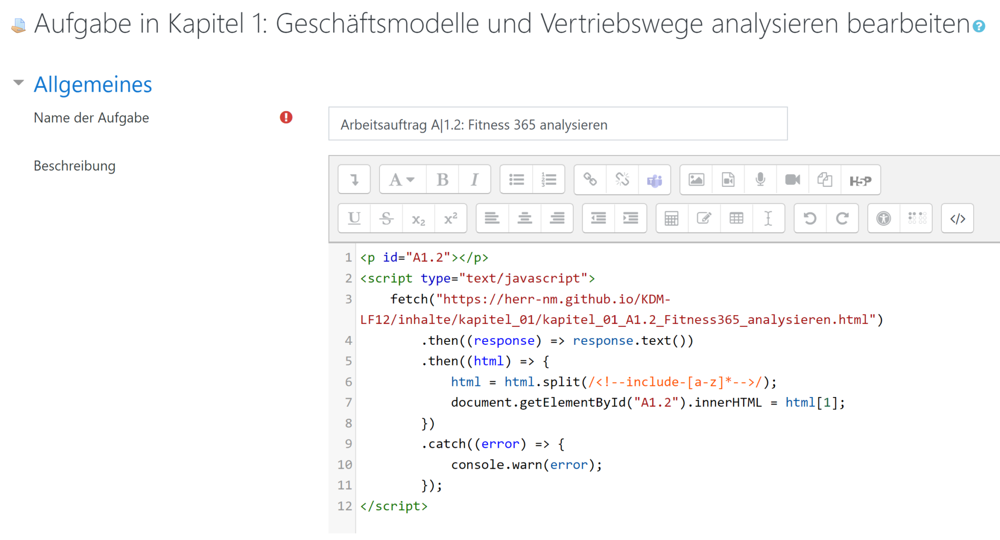

# Integration von Git-versionierten Inhalten  (z.B. Markdown) in einen Moodle-Kurs

## Cisco Akademietag

### 04.11.2022 | MMBbS

---

# Markdown

- Einfache Auszeichnungssprache
- Leicht in HTML & PDF zu exportieren
- Mit [Pandoc](https://pandoc.org/) diverse Konvertierungen möglich

---

# MkDocs

- Zusammenfassung für Markdown-Dateien
- Generiert durchsuchbare statische Webseite mit Menüs
- Konfiguration in einer YAML-Datei
- Extensions und Themes verfügbar

---

# Git

- Versionierung von Dateien
- Dateiverwaltung in Repositorys

---

# GitHub & GitLab

- Versionsverwaltung goes Internet
- Erweitert Git um Remote-Repositorys
- Kooperation & Kollaboration

---

# Github Pages

- Webseiten-Hosting
- Direkt aus dem Github-Repository

---

# Visual Studio Code

- Kostenlose Entwicklungsumgebung
- Mit Extensions ein *Schweizer Taschenmesser*
- Plattformübergreifend

---

# Moodle

- *Versteht* Markdown (wie viele andere CMS auch)
- Kann JavaScript ausführen

---

# Include Markdown to Moodle

- JavaScript zum Nachladen von Inhalten
- Quelle ist *Github Pages*

---

# Und wie geht es weiter?

- Kooperative Unterrichtsentwicklung
- Issues bei Fehlern
- ...

---

# Ach ja ...

- Präsentationen auf Basis von Markdown
- Textbasiert
- Im GitHub öffentlich :-)